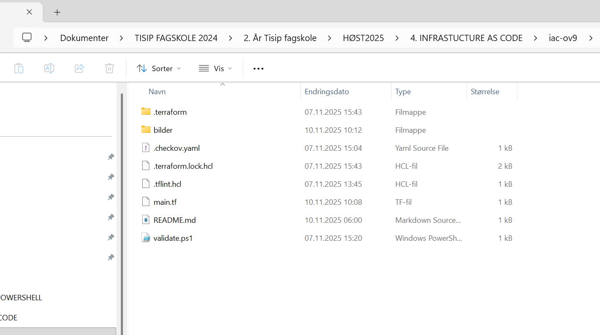
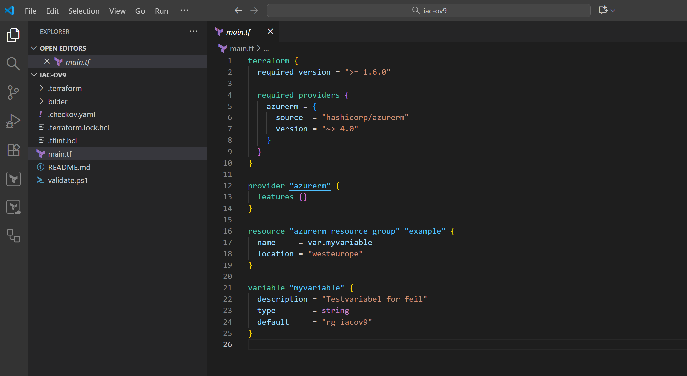
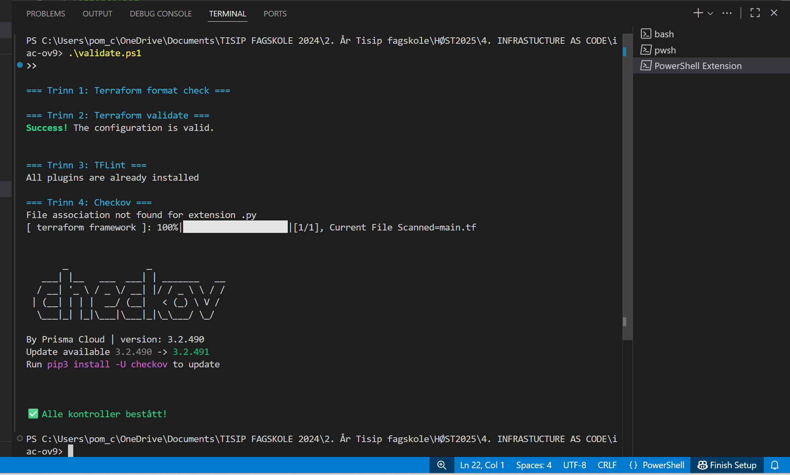
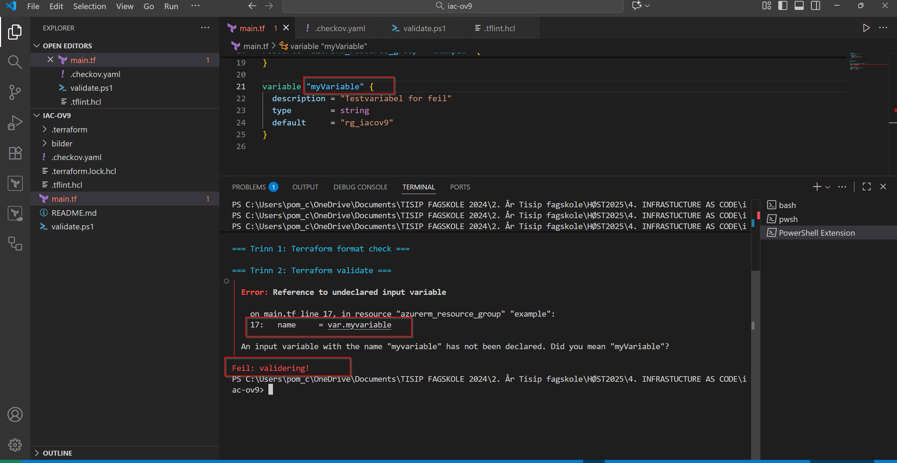
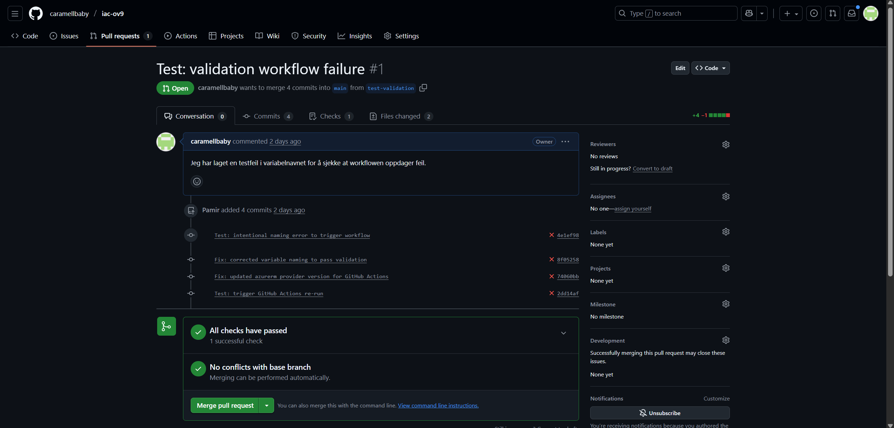
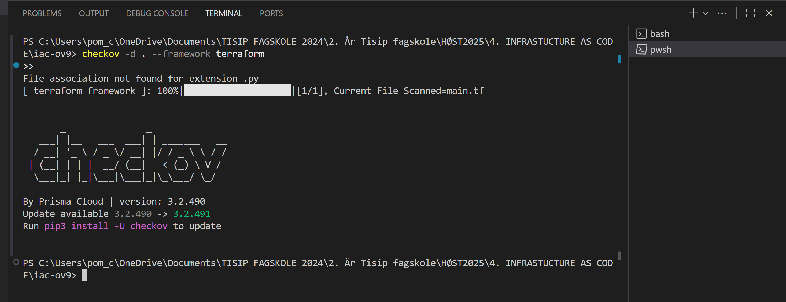
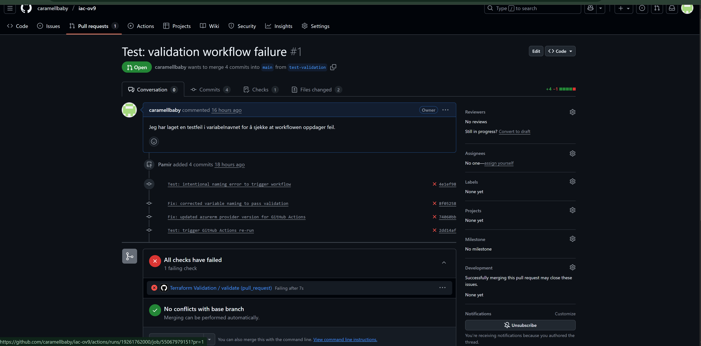

# Øving 9 – Infrastructure as Code

I denne øvingen lærte jeg hvordan man kan sjekke kvalitet og sikkerhet i Terraform-kode.  
Jeg brukte **TFLint** og **Checkov**, og laget et eget PowerShell-script (`validate.ps1`) som kjører alle testene automatisk.

---

# Mappestruktur
Slik ser prosjektet mitt ut:

---

# Verktøy jeg brukte
- **Terraform**     – til å lage infrastrukturen
- **TFLint**        – sjekker kodekvalitet
- **Checkov**       – sjekker sikkerhet
- **PowerShell**    – kjører scriptet automatisk
- **VSCode**        – for å jobbe med prosjektet

---

# Alle kontroller bestått
Her ser du at alle testene ble godkjent:

---

# Test av feil
Jeg lagde en feil med vilje (camelCase-variabel) for å se om scriptet oppdaget det:

---

## Endelig validering bestått
Det var lærerikt å se hvordan en feil i koden ble fanget automatisk av workflowen.  
Etter å ha rettet feilen og oppdatert provideren ble alle sjekker grønne, noe som viser at oppsettet nå er stabilt.

Her ser man at workflowen til slutt bestod alle tester i GitHub Actions:

---

# Checkov-sjekk
Checkov kjørte en sikkerhetstest og fant ingen alvorlige feil:

---

# Refleksjon
Jeg lærte mye av denne øvingen:
- Det er lurt å teste lokalt før man pusher til GitHub.  
- CI/CD-testing hjelper teamet med å unngå feil i hovedkoden.  
- TFLint fant feil i navngiving og bruk av variabler, mens Checkov passet på sikkerheten.  
- Jeg synes det var lærerikt å lage et PowerShell-script som kjører alt automatisk.

---

# Resultat av GitHub Actions-test
Jeg testet også workflowen i GitHub Actions.  
Når jeg pushet en endring til branchen, startet Terraform Validation automatisk.  
Den oppdaget en feil i koden, og testen feilet – noe som viser at oppsettet fungerer som det skal.  

---

 Dato: 12. november 2025  
 Student: Pamir Kargar  
 Fag: Infrastructure as CodeTrigger workflow
